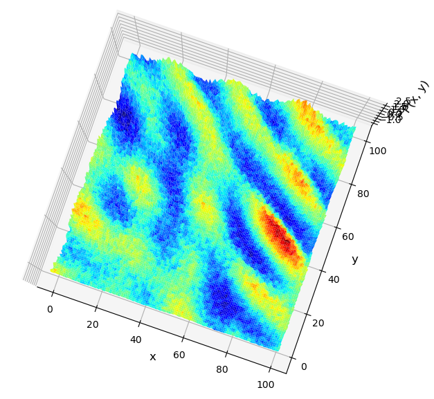

# LatticeGaugeNeuralNetworks
Some introductory exercises on Normalizing Flow applied to multimodal distributions. 
We hope to be able to apply asap some results to Gauge Theories and QCD (still faaaar away).  
The generation of Gaussian Mixture multimodal PDF and the training of the model through the Normalizing Flow, using PyTorch, is in normflow directory:  
-Generating initial data: [normflow/module/multimodal.py](https://github.com/GennaroCalandriello/LatticeGaugeNeuralNetworks/blob/main/normflow/module/multimodal.py)  
-Training and running the model: [normflow/Flowbased.py](https://github.com/GennaroCalandriello/LatticeGaugeNeuralNetworks/blob/main/normflow/FlowBased.py).  
In the multimodal.py there are 2 kind of distributions: GMM and a $\cos(x+y)+\sin(x+y)$. the following images represent a configuration generated by the model (rude and very noisy still), in comparison with one of the configurations on which the model is trained:  
-Sample from training set (trained from 200 epochs, using a small sample of 500 initial distributions):  
  
-PDF generated from trained model:  
  
-Loss function of validation set:  
  

